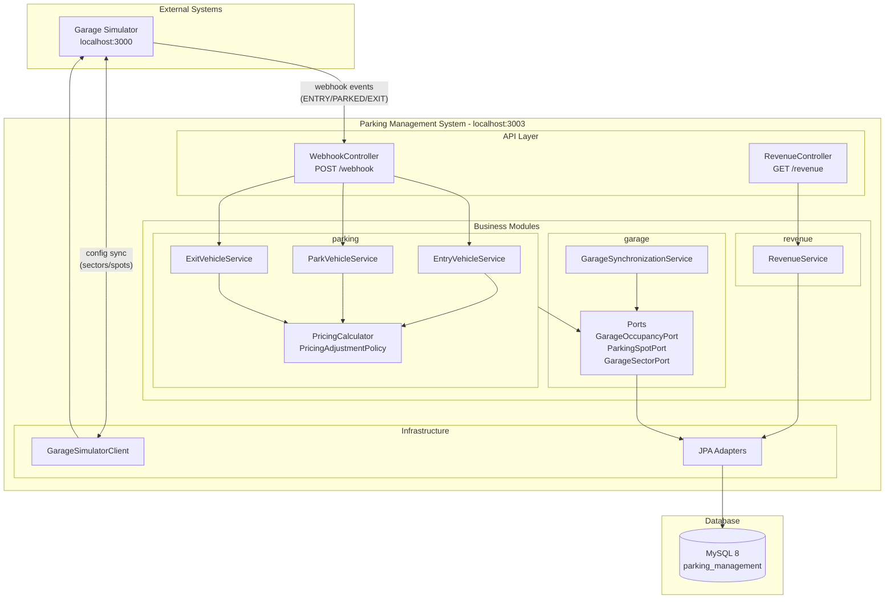
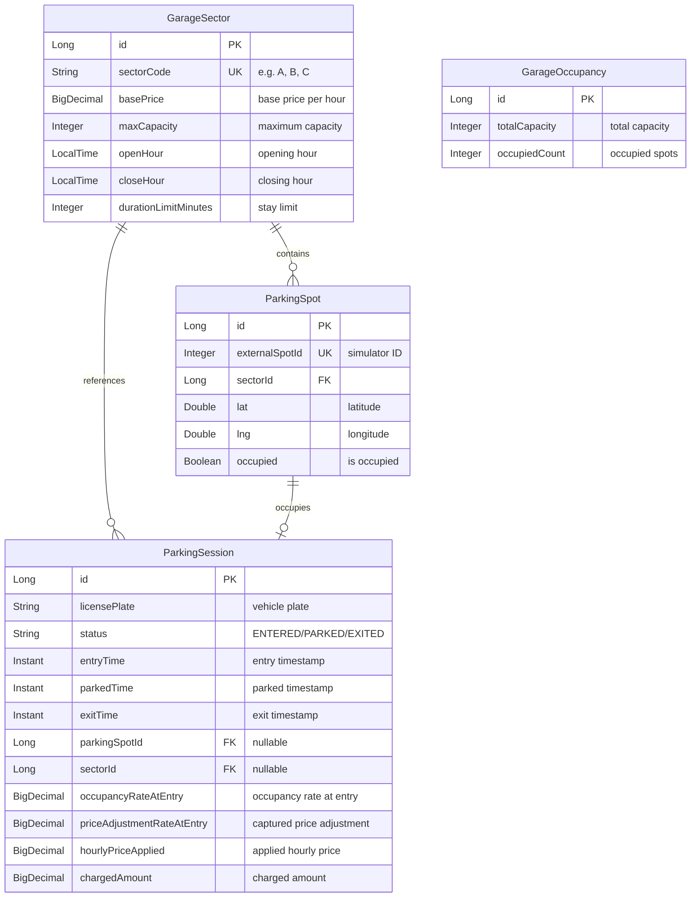
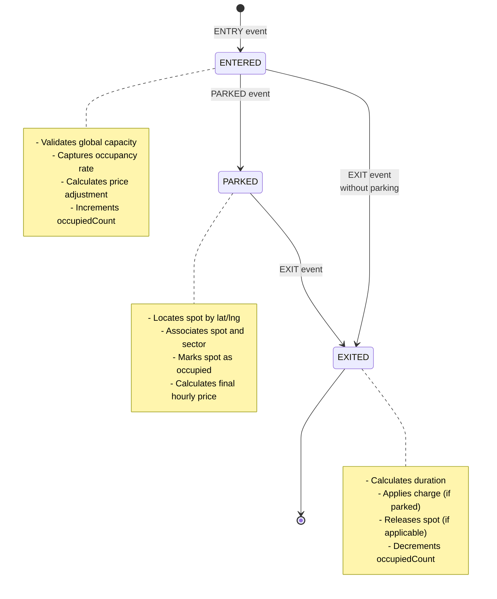

# Parking Garage Management System

[](https://openjdk.org/projects/jdk/21/)
[](https://spring.io/projects/spring-boot)
[](https://www.mysql.com/)

Backend service for managing parking garage operations, including vehicle entry and exit processing, parking spot allocation, and revenue calculation.

The service integrates with an **external garage simulator** that emits parking events through a webhook interface. The simulator is **required** for the application to function correctly — it provides sector/spot configuration and emits the parking lifecycle events.

---

## Table of Contents

- [Features](#features)
- [Architecture](#architecture)
- [Domain Model](#domain-model)
- [Parking Lifecycle](#parking-lifecycle)
- [Pricing Rules](#pricing-rules)
- [Tech Stack](#tech-stack)
- [Prerequisites](#prerequisites)
- [How to Run](#how-to-run)
- [API Documentation](#api-documentation)
- [Configuration](#configuration)
- [Project Structure](#project-structure)
- [Testing Strategy](#testing-strategy)
- [Architectural Decisions](#architectural-decisions)

---

## Features

| Feature | Description |
|---------|-------------|
| **Event Processing** | Processes `ENTRY`, `PARKED`, and `EXIT` events received via webhook |
| **Occupancy Control** | Manages occupancy by sector and global garage capacity |
| **Dynamic Pricing** | Automatically adjusts prices based on occupancy rate at entry time |
| **Revenue Query** | API to query aggregated revenue by sector and date |
| **Concurrency Control** | Pessimistic locks ensure consistency in simultaneous operations |
| **Automatic Synchronization** | Synchronizes sector and spot configuration with the simulator on startup |

---

## Architecture

The project follows a **modular monolith** architecture organized by business domain, with clear separation between layers.



### Business Modules

| Module | Responsibility |
|--------|----------------|
| **garage** | Configuration synchronization, sector management, spots, and occupancy |
| **webhook** | Event ingestion endpoint and dispatch to appropriate services |
| **parking** | Parking sessions, event processing, pricing rules |
| **revenue** | Aggregated revenue query by sector and date |
| **shared** | Shared exceptions, configuration, and utilities |

---

## Domain Model

The domain is modeled with **pure POJO entities**, without framework dependencies. Persistence is isolated through the **Ports/Adapters** pattern.



### Main Entities

| Entity | Description |
|--------|-------------|
| **GarageSector** | Sector configuration (price, capacity, hours) synchronized from simulator |
| **ParkingSpot** | Physical parking spot with geographic coordinates |
| **ParkingSession** | Complete lifecycle of a vehicle in the garage |
| **GarageOccupancy** | Global occupancy aggregate for entry control |

---

## Parking Lifecycle



### Event Flow

#### 1. ENTRY (Vehicle Entry)

```json
{
  "license_plate": "ZUL0001",
  "entry_time": "2025-01-01T12:00:00",
  "event_type": "ENTRY"
}
```

**Processing:**
1. Validates no active session exists for the plate
2. Loads `GarageOccupancy` with pessimistic lock
3. Validates garage is not full
4. Calculates price adjustment based on current occupancy
5. Creates `ParkingSession` with status `ENTERED`
6. Increments `occupiedCount`

#### 2. PARKED (Vehicle Parked)

```json
{
  "license_plate": "ZUL0001",
  "lat": -23.561684,
  "lng": -46.655981,
  "event_type": "PARKED"
}
```

**Processing:**
1. Locates active session with lock
2. Finds spot by coordinates (lat/lng)
3. Validates spot is free
4. Marks spot as occupied
5. Associates spot and sector to session
6. Calculates and stores `hourlyPriceApplied`
7. Updates status to `PARKED`

#### 3. EXIT (Vehicle Exit)

```json
{
  "license_plate": "ZUL0001",
  "exit_time": "2025-01-01T14:00:00",
  "event_type": "EXIT"
}
```

**Processing:**
1. Locates active session with lock
2. Sets `exitTime`
3. If `PARKED`: calculates duration, applies charge, releases spot
4. If `ENTERED` (without parking): closes with zero charge
5. Updates status to `EXITED`
6. Decrements `occupiedCount`

### Special Case: Entry Without Parking

A vehicle can enter and exit without ever parking:

```
ENTRY → EXIT (without PARKED)
```

In this case:
- No spot is allocated
- No sector is associated
- **Charge = $0.00**

---

## Pricing Rules

### Free Tolerance

| Duration | Charge |
|----------|--------|
| Up to 30 minutes | **Free** |
| Over 30 minutes | Charged by hour (rounded up) |

**Examples:**
- 20 min → 0 hours charged
- 31 min → 1 hour charged
- 61 min → 2 hours charged
- 90 min → 2 hours charged

### Dynamic Adjustment by Occupancy

The adjustment is captured at **ENTRY** time, based on **global** garage occupancy:

| Occupancy Rate | Price Adjustment |
|----------------|------------------|
| < 25% | **-10%** (discount) |
| 25% - 50% | **0%** (base price) |
| 50% - 75% | **+10%** |
| 75% - 100% | **+25%** |

### Calculation Formula

```
hourlyPriceApplied = sector.basePrice × (1 + priceAdjustmentRateAtEntry)

chargedAmount = hourlyPriceApplied × chargeableHours
```

**Example:**
- Sector base price: $10.00/hour
- Occupancy at entry: 60% → Adjustment: +10%
- Applied price: $10.00 × 1.10 = **$11.00/hour**
- Duration: 2 hours
- Final charge: $11.00 × 2 = **$22.00**

---

## Tech Stack

| Technology | Version | Purpose |
|------------|---------|---------|
| **Java** | 21 | Main language with modern features (records, pattern matching) |
| **Spring Boot** | 3.5 | Main framework |
| **Spring Data JPA** | - | Persistence and repositories |
| **Spring Validation** | - | DTO and parameter validation |
| **MySQL** | 8.0 | Relational database |
| **HikariCP** | - | High-performance connection pool |
| **SpringDoc OpenAPI** | 2.8.6 | Swagger UI documentation |
| **Testcontainers** | - | Containers for integration tests |
| **JUnit 5** | - | Testing framework |
| **MockMvc** | - | HTTP API tests |
| **Docker Compose** | - | Local environment orchestration |

---

## Prerequisites

- **Java 21+** 
- **Maven 3.8+** 
- **Docker and Docker Compose** 

---

## How to Run

### Option 1: Docker Compose (Recommended)

Start MySQL and the garage simulator:

```bash
docker-compose up -d
```

Start the application:

```bash
./mvnw spring-boot:run
```

### Option 2: Local MySQL

If you already have MySQL running locally, adjust `src/main/resources/application.yml` as needed and run:

```bash
./mvnw spring-boot:run
```

### Garage Simulator (Required)

The simulator must be running for the application to work. With Docker Compose, it starts automatically. To run standalone:

```bash
docker run -d --network="host" cfontes0estapar/garage-sim:1.0.0
```

> **Note (Docker Desktop):** Host networking mode may be disabled by default. If the container runs but webhook/initialization communication fails, enable it in Docker Desktop settings.

### URLs

| Resource | URL |
|----------|-----|
| **API** | http://localhost:3003 |
| **Swagger UI** | http://localhost:3003/swagger-ui.html |
| **API Docs (JSON)** | http://localhost:3003/v3/api-docs |
| **Garage Simulator** | http://localhost:3000 |

---

## API Documentation

### POST /webhook

Receives events from the external simulator. Unified payload with conditional validation by `event_type`.

#### Request

| Field | Type | Required | Description |
|-------|------|----------|-------------|
| `license_plate` | string | Always | Vehicle license plate |
| `event_type` | enum | Always | `ENTRY`, `PARKED`, or `EXIT` |
| `entry_time` | datetime | ENTRY | Entry date/time (ISO 8601) |
| `lat` | double | PARKED | Spot latitude |
| `lng` | double | PARKED | Spot longitude |
| `exit_time` | datetime | EXIT | Exit date/time (ISO 8601) |

#### Request Examples

**ENTRY:**
```json
{
  "license_plate": "ZUL0001",
  "entry_time": "2025-01-01T12:00:00",
  "event_type": "ENTRY"
}
```

**PARKED:**
```json
{
  "license_plate": "ZUL0001",
  "lat": -23.561684,
  "lng": -46.655981,
  "event_type": "PARKED"
}
```

**EXIT:**
```json
{
  "license_plate": "ZUL0001",
  "exit_time": "2025-01-01T14:00:00",
  "event_type": "EXIT"
}
```

#### Response (Success - 200)

```json
{
  "message": "Vehicle entry registered successfully",
  "timestamp": "2025-01-01T12:00:00.123Z"
}
```

#### Error Codes

| HTTP Status | Code | Description |
|-------------|------|-------------|
| 400 | `VALIDATION_ERROR` | Invalid payload |
| 404 | `SPOT_NOT_FOUND` | Spot not found at coordinates |
| 404 | `ACTIVE_SESSION_NOT_FOUND` | Active session not found for plate |
| 409 | `GARAGE_FULL` | Garage is full |
| 409 | `SPOT_ALREADY_OCCUPIED` | Spot already occupied |
| 409 | `ACTIVE_SESSION_ALREADY_EXISTS` | Active session already exists for plate |
| 409 | `INVALID_SESSION_TRANSITION` | Invalid state transition |
| 500 | `INTERNAL_ERROR` | Unexpected error |

#### Error Response

```json
{
  "code": "GARAGE_FULL",
  "message": "Garage is full: 100/100",
  "timestamp": "2025-01-01T12:00:00.123Z"
}
```

---

### GET /revenue

Query aggregated revenue by sector and date.

#### Query Parameters

| Parameter | Type | Required | Description |
|-----------|------|----------|-------------|
| `date` | date | Yes | Date in `YYYY-MM-DD` format |
| `sector` | string | Yes | Sector code (e.g., `A`) |

#### Request Example

```http
GET /revenue?date=2025-01-01&sector=A
```

#### Response (Success - 200)

```json
{
  "amount": 150.00,
  "currency": "BRL",
  "timestamp": "2025-01-01T23:59:59Z"
}
```

#### Aggregation Rule

Revenue is calculated by summing `charged_amount` from all sessions:
- With status `EXITED`
- From the specified sector
- Whose `exit_time` matches the given date

---

## Configuration

### application.yml

| Property | Default | Description |
|----------|---------|-------------|
| `server.port` | `3003` | Application port |
| `spring.datasource.url` | `jdbc:mysql://localhost:3307/parking_management` | MySQL connection URL |
| `spring.datasource.username` | `root` | Database user |
| `spring.datasource.password` | `****` | Database password |
| `spring.jpa.hibernate.ddl-auto` | `update` | Schema strategy (update for dev) |
| `garage.simulator.base-url` | `http://localhost:3000` | Simulator URL |
| `logging.level.com.estapar` | `DEBUG` | Application log level |

### HikariCP (Connection Pool)

| Property | Value |
|----------|-------|
| `maximum-pool-size` | 10 |
| `minimum-idle` | 5 |
| `idle-timeout` | 300000 ms |
| `connection-timeout` | 20000 ms |

---

## Project Structure

```
src/main/java/com/estapar/parking_management/
├── ParkingManagementApplication.java
│
├── shared/
│   ├── config/                     # Configurations (Jackson, RestClient)
│   └── exception/                  # Exceptions and GlobalExceptionHandler
│       ├── ApiErrorResponse.java
│       ├── GlobalExceptionHandler.java
│       ├── GarageFullException.java
│       ├── SpotAlreadyOccupiedException.java
│       ├── ActiveSessionNotFoundException.java
│       └── ...
│
├── garage/
│   ├── application/
│   │   ├── port/                   # Interfaces (Ports)
│   │   │   ├── GarageSectorPort.java
│   │   │   ├── ParkingSpotPort.java
│   │   │   └── GarageOccupancyPort.java
│   │   ├── GarageSynchronizationService.java
│   │   └── GarageInitializationService.java
│   ├── domain/                     # Pure POJO entities
│   │   ├── GarageSector.java
│   │   ├── ParkingSpot.java
│   │   └── GarageOccupancy.java
│   └── infrastructure/
│       ├── client/                 # Simulator REST client
│       │   └── GarageSimulatorClient.java
│       └── persistence/
│           ├── entity/             # JPA entities
│           ├── mapper/             # Domain ↔ Entity mappers
│           └── repository/
│               └── adapter/        # Port implementations
│
├── webhook/
│   ├── api/
│   │   ├── WebhookController.java
│   │   └── dto/
│   │       ├── WebhookEventRequest.java
│   │       ├── WebhookEventResponse.java
│   │       └── WebhookEventType.java
│   └── application/
│       └── WebhookEventDispatcher.java
│
├── parking/
│   ├── api/dto/
│   ├── application/
│   │   ├── EntryVehicleService.java
│   │   ├── ParkVehicleService.java
│   │   ├── ExitVehicleService.java
│   │   ├── PricingCalculator.java
│   │   ├── PricingAdjustmentPolicy.java
│   │   └── port/
│   │       └── ParkingSessionPort.java
│   ├── domain/
│   │   ├── ParkingSession.java
│   │   └── ParkingSessionStatus.java
│   └── infrastructure/persistence/
│
└── revenue/
    ├── api/
    │   ├── RevenueController.java
    │   └── dto/
    │       └── RevenueResponse.java
    ├── application/
    │   └── RevenueService.java
    └── infrastructure/persistence/
        └── RevenueRepository.java
```

---

## Testing Strategy

The project has **29 test files** covering different levels:

### Unit Tests

Focus on pure business rules:

| Class | Coverage |
|-------|----------|
| `PricingCalculatorTest` | 30-min tolerance, hour rounding |
| `PricingAdjustmentPolicyTest` | Adjustment table by occupancy |
| `ParkingSessionTest` | Entity invariants |
| `GarageOccupancyTest` | Increment/decrement, occupancy rate |
| `GarageSectorTest` | Sector validations |

### Integration Tests

Validate persistence and transactions with **Testcontainers + MySQL**:

| Class | Coverage |
|-------|----------|
| `EntryVehicleServiceIntegrationTest` | Complete entry flow |
| `ParkVehicleServiceIntegrationTest` | Parking flow |
| `ExitVehicleServiceIntegrationTest` | Exit flow and charging |
| `*RepositoryTest` | Persistence operations |

### Concurrency Tests

Validate pessimistic locks with real threads:

| Scenario | Expectation |
|----------|-------------|
| 2 simultaneous ENTRY with 1 spot | Exactly 1 success, 1 `GarageFullException` |
| 2 PARKED for same spot | Exactly 1 success, 1 `SpotAlreadyOccupiedException` |
| 2 EXIT for same session | Exactly 1 success, 1 failure |

### E2E Tests

Validate complete flow via HTTP with **MockMvc**:

```
ENTRY → PARKED → EXIT → GET /revenue
```

### Running Tests

```bash
# All tests
./mvnw test

# Specific tests
./mvnw test -Dtest=ParkingFlowE2ETest
./mvnw test -Dtest=ParkingConcurrencyTest
```

---

## Architectural Decisions

### 1. Modular Monolith

**Motivation:** Operational simplicity with good code organization.

**Benefits:**
- Clear organization by business domain
- High cohesion within each module
- Low coupling between modules
- Simpler than microservices for project scope

### 2. JPA-Free Domain

**Motivation:** Separate business rules from infrastructure details.

**Implementation:**
- `domain/`: Pure POJO entities with business rules
- `application/port/`: Interfaces defining persistence contracts
- `infrastructure/persistence/entity/`: JPA entities with annotations
- `infrastructure/persistence/repository/adapter/`: Port implementations

### 3. Pessimistic Locks for Concurrency

**Motivation:** Scarce resources (spots, capacity) require deterministic behavior.

**Protected resources:**
- `GarageOccupancy` - global capacity control
- `ParkingSpot` - spot occupation
- `ParkingSession` - state transitions

**Consistent lock order** to avoid deadlocks:
1. `ParkingSession`
2. `ParkingSpot`
3. `GarageOccupancy`

### 4. State-Based Idempotency

**Motivation:** Simplicity without dedicated deduplication infrastructure.

**Implementation:**
- `ENTRY` for plate with active session → conflict
- `PARKED` for already parked session → conflict
- `EXIT` for already closed session → conflict

### 5. Price Adjustment Captured at Entry

**Motivation:** At entry, the sector is still unknown (vehicle chooses spot later).

**Solution:**
- Captures `priceAdjustmentRateAtEntry` based on **global** occupancy
- Calculates `hourlyPriceApplied` only at `PARKED`, when sector is known

---

## License

This project was developed as part of a technical challenge.
